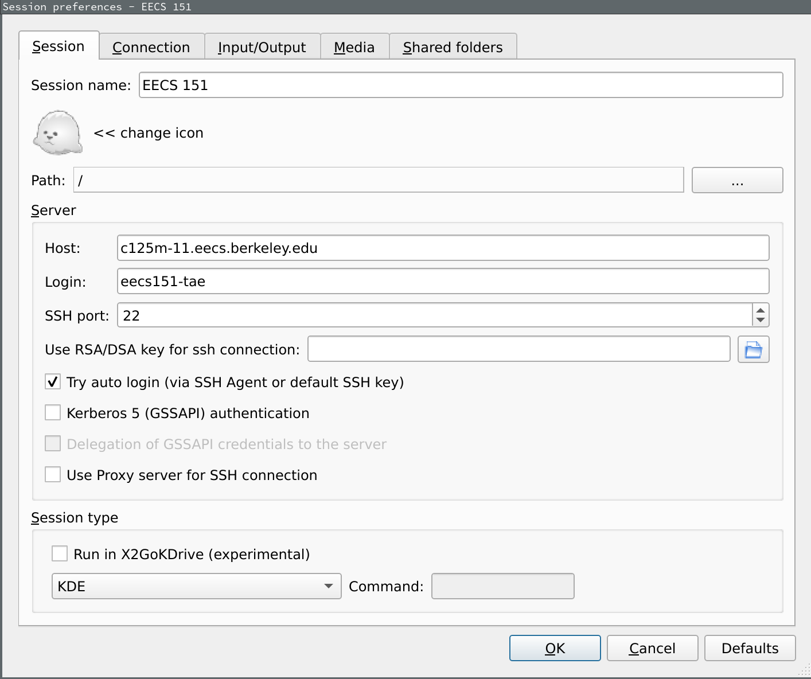

# EECS151/251A Fall 2021 FPGA Lab 1
<p align="center">
Prof. Bora Nikolic
</p>
<p align="center">
TAs: Alisha Menon, Zhenghan Lin, Charles Hong, Vighnesh Iyer
</p>
<p align="center">
Department of Electrical Engineering and Computer Science
</p>
<p align="center">
College of Engineering, University of California, Berkeley
</p>

## Lab 1: Getting Set Up - Account, FPGA Board, Vivado, Basic Verilog

### Setting Up Accounts

#### Where to Get Info
- The [course webpage](https://inst.eecs.berkeley.edu/~eecs151/fa21/) for lecture slides, links to labs, homework postings, and times for labs/discussions/OH
- [Gradescope](https://www.gradescope.com/courses/295948) for submitting homework
    - You should have received an invite email from Gradescope if you are enrolled
- [Piazza](https://piazza.com/class/ksp46zb1zfq1u4) for announcements and a discussion forum for homeworks / labs
    - You should register a Piazza account and enroll in the class page as soon as possible

#### Getting an EECS 151 Account
All students enrolled in the FPGA lab are required to get a EECS 151 class account to login to the workstations in lab.
Get a class account by using [this webapp](https://inst.eecs.berkeley.edu/webacct).

Login using your CalNet ID, click on 'Get a new account' in the eecs151 row.
Once the account has been created, you should email your class account form to yourself to have a record of your account information.

#### Log In To a Workstation
##### In the Lab
Log in to a workstation in the lab, using your `eecs151-xxx` login and initial password.

##### Remotely
The workstations used for this class are `c125m-1.eecs.berkeley.edu` - `c125m-19.eecs.berkeley.edu`, and are physically located in Cory 111/117.
Other servers such as `eda-1.eecs.berkeley.edu` through `eda-8.eecs.berkeley.edu` can be used for development too.
You can access all of these machines remotely through SSH.

Not all lab workstations will necessarily be available at a given time, so try a different one if you're having trouble connecting.

Log in to a lab machine by SSHing with your class account `eecs151-xxx`.
```shell
ssh eecs151-xxx@c125m-11.eecs.berkeley.edu
```

#### Changing Your EECS151 Account Password
Run `ssh update.cs.berkeley.edu` once you have logged in physically or remotely on your `eecs151-xxx` account.
Follow the prompts to set up a new password.

You can always use the [same webapp](https://inst.eecs.berkeley.edu/webacct) that you used to create your account to reset your password if you forget it.

#### Getting a Github Account
If you haven't done so before, sign up for a [Github account](https://github.com/signup) with your `berkeley.edu` email address.

If you already have a Github account that's registered with your personal email address, don't create a new account.
Instead, log in to Github, [go here](https://github.com/settings/emails), and add your `berkeley.edu` email address to your Github account.

#### SSH Keys
We will use SSH keys to authenticate with Github.
Run these commands when logged in on your `eecs151-xxx` account.

- Create a new SSH key:
```shell
ssh-keygen -t ed25519 -C "your_email@example.com"
```
Keep hitting enter to use the default settings.

- Copy your public key:
```
cat ~/.ssh/id_rsa.pub
```
Copy the text that's printed out.

- Add the key to your Github account. [Go here](https://github.com/settings/keys), click on "New SSH Key", paste your public key, and click "Add SSH key".

- Finally test your SSH connection
```shell
ssh -T git@github.com
Hi <username>! You've successfully authenticated, but GitHub does not provide shell access.
```

#### Some Notes for Remote Login
If you're using the lab machines from your laptop, here are a few more things to do.

##### Use SSH Keys to Log In Without a Password
Run this from your laptop to copy your public key to the lab machine.
```shell
ssh-copy-id eecs151-xxx@c125m-11.eecs.berkeley.edu
```

Now you should be able to ssh to the lab machine without providing a password.
```shell
ssh eecs151-xxx@c125m-11.eecs.berkeley.edu
```

##### Use X2go for a Remote Desktop
To run software on the lab machine that requires a graphical user interface (e.g. firefox, vivado GUI), you should use `x2go`.
[Install it from here](https://wiki.x2go.org/doku.php) (or install the `x2goclient` package if you're using Linux).

Open `x2go`, create new session with the following settings (use your `eecs151-xxx` class account in the "Login" field)

<p align="center">

</p>

Click the session on the right bar to start it, and you should see a CentOS Linux desktop environment.
This desktop is running on the lab machine of your choice and is being forwarded to you by `x2go`.

### Getting Familiar with our Development Environment

#### Linux Basics
We will be using a Linux development environment.
If you are unfamiliar or uncomfortable with Linux, and in particular, using the bash shell, you should definitely check out [this tutorial](https://www.digitalocean.com/community/tutorial_series/getting-started-with-linux).

It is highly recommended to go through all four parts of the tutorial above.
To complete the labs and projects for this course, you will need good command line skills.

One of the best ways to expand your working knowledge of bash is to watch others who are more experienced. Pay attention when you are watching someone else's screen and ask questions when you see something you don't understand. You will quickly learn many new commands and shortcuts.

#### Git Basics
Feel free to skip this section if you already have some prior experience with using git.

Version control systems help track how files change over time and make it easier for collaborators to work on the same files and share their changes.
For projects of any reasonable complexity, some sort of version control is an absolute necessity.

In this class, we will be using Git, one of the most popular version control systems.
Make the effort to understand how Git works, as it will make understanding how to actually use it much easier.
Please check out [this link](http://git-scm.com/book/en/Getting-Started-Git-Basics), which provides a good high level overview

Once you think you understand the material above, please complete [this tutorial](http://try.github.com).

Git is a very powerful tool, but it can be a bit overwhelming at first. If you don't know what you are doing, you can really cause lots of headaches for yourself and those around you, so please be careful. If you are ever doubtful about how to do something with Git ask a TA or an experienced classmate.

For the purposes of this class you will probably only need to be proficient with the following commands:
- `git status`
- `git add`
- `git commit`
- `git pull`
- `git push`
- `git clone`

However, if you put in the effort to learn how to use some of the more powerful features (diff, blame, branch, log, mergetool, rebase, and many others), they can really increase your productivity.

*Optional*: If you would like to explore further, check out the [slightly more advanced tutorial written for CS250](http://inst.eecs.berkeley.edu/~cs250/fa13/handouts/tut1-git.pdf)

### Acquiring Lab Files
The lab files, and eventually the project files, will be made available through a git repository provided by the staff.

Run this from your `eecs151-xxx` home directory:
```shell
git clone git@github.com:EECS150/fpga_labs_fa21.git
```

Whenever a new lab is released, you should only need to `git pull` to retrieve the new files.
If there are any updates, `git pull` will fetch the changes and merge them in.

You can create your own repository to store your lab code, but make sure the repo is private.
Later on, each team will receive their own private repo for the final project, and you will be able to push and pull from that.

