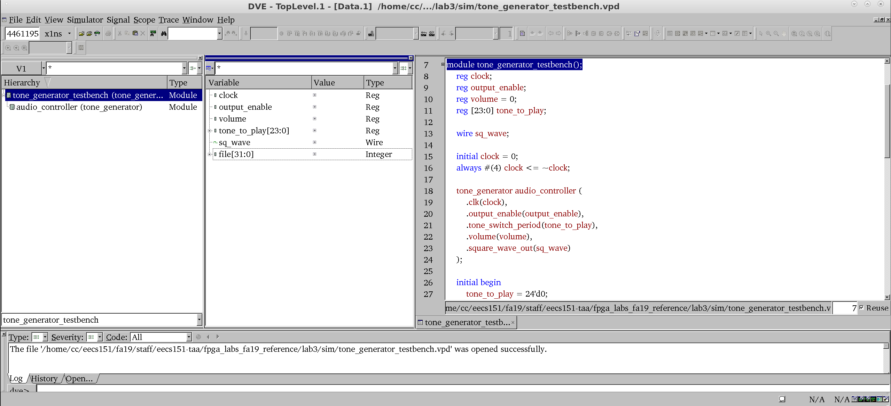
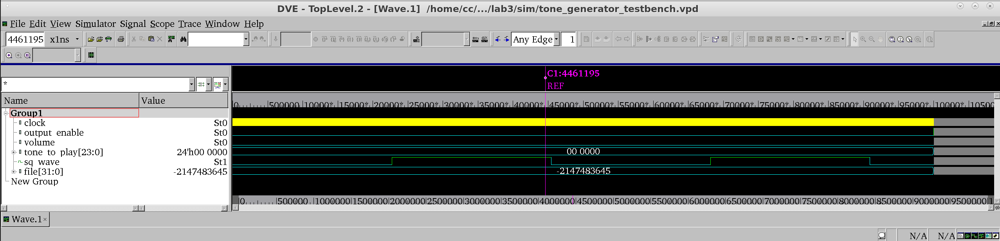

# FPGA Lab 2: Introduction to FPGA Development
<p align="center">
Prof. Bora Nikolic
</p>
<p align="center">
TAs: Alisha Menon, Zhenghan Lin, Charles Hong, Vighnesh Iyer
</p>
<p align="center">
Department of Electrical Engineering and Computer Science
</p>
<p align="center">
College of Engineering, University of California, Berkeley
</p>

### Before You Start This Lab
Make sure that you have gone through and completed the steps involved in Lab 1.
Let the TA know if you are not signed up for this class on Piazza or if you do not have a class account (`eecs151-xxx`), so we can get that sorted out.

To fetch the skeleton files for this lab, `cd` to the git repository (`fpga_labs_fa21`) that you had cloned in the first lab and execute the command `git pull`.

Go through the [Verilog Primer Slides](http://inst.eecs.berkeley.edu/~eecs151/fa21/files/verilog/Verilog_Primer_Slides.pdf); you should feel somewhat comfortable with the basics of Verilog to complete this lab.

## A Structural and Behavioral Adder Design

### Build a Structural 14-bit Adder
To help you with this task, please refer to the `Code Generation with for-generate loops` slide in the Verilog Primer Slides (slide 35).

- Open `lab2/src/full_adder.v`: fill in the logic to produce the full adder outputs from the inputs.
- Open `structural_adder.v` and construct a ripple carry adder using the full adder cells you designed earlier and a 'for-generate loop'.
- Finally, inspect the `z1top.v` top-level module and see how your structural adder is instantiated and hooked up to the top-level signals.
  For now, just look at the `user_adder` instance of your structural adder.
  As we learned in previous lab, the basic I/O options on the PYNQ-Z1 board are limited.
  *How are we getting two 3-bit integers as inputs from the board?*
- Generate a bitstream.
  Like last time, we have provided a Makefile that automates running Vivado.
  Run synthesis with `make synth` and place and route/generate bitstream with `make impl`.
- Program the FPGA with `make program` and test out the design.
  Try entering different binary numbers into your adder with the switches and buttons and see that the correct sum is displayed on the IO LEDs.
- If the circuit doesn't work properly on your first try, don't worry and move on to the next section where we simulate the `structural_adder` and you can easily fix bugs.

### Build a Behavioral 14-bit Adder
Check out `behavioral_adder.v`.
It has already been filled with the appropriate logic for you.
Notice how behavioral Verilog allows you to describe the function of a circuit rather than the topology or implementation.

In `z1top.v`, you can see that the `structural_adder` and the `behavioral_adder` are both instantiated in the self-test section.
A module called `adder_tester` (in `src/adder_tester.v`) has been written for you that will check that the sums generated by both your adders are equal for all possible input combinations of `a` and `b`.

If both your adders are operating identically, both RGB LEDs will light up.
Verify this on your board.

## Simulating the Adder
Let's run some simulations on the `structural_adder` in software to check it works.
Typically, this is done before putting our design on the FPGA, but because the adder is simple, we started with the FPGA this time.

To do this, we will need to use a *Verilog testbench*.
A Verilog testbench is designed to test a Verilog module by supplying it with the inputs it needs (stimulus signals) and testing whether the outputs of the module match what we expect.

### Overview of Testbench Skeleton
Check the provided testbench skeleton in `lab2/sim/adder_testbench.v`.
Let's go through what every line of this testbench does.

```verilog
`timescale 1ns/1ns
```

The timescale declaration needs to be at the top of every testbench file.
```verilog
`timescale (simulation time unit)/(simulation resolution)
```

The first argument to the timescale declaration is the simulation time unit.
It specifies how much time *1 unit* of simulation time represents.
In this case, we have defined the simulation time unit to be one nanosecond, so *1 unit* of simulation time equals one nanosecond.

The second argument to the timescale declaration is the simulation resolution, which tells the simulator to model transient behavior of your circuit at that resolution.
In our example it is also 1 nanosecond.
For this lab, we aren't modeling any gate delays, so the resolution can safely equal the time unit.

```verilog
`define SECOND 1000000000
`define MS 1000000
```

These are some macros defined for our testbench.
They are constant values you can use when writing your testbench to simplify your code and make it obvious what certain numbers mean.
For example, `SECOND` is defined as the number of nanoseconds in one second.

```verilog
module adder_testbench();
  // Testbench code goes here
endmodule
```

`adder_testbench` is a testbench module.
It is not intended to be placed on an FPGA, but rather it is to be run by a circuit simulator.
All your testbench code goes in this module.
We will instantiate our DUT (device under test) in this module.

```verilog
reg [13:0] a = 0;
reg [13:0] b;
wire [14:0] sum;
```
Now we declare nets to hold the inputs and outputs that go in and out of the DUT.
Notice that the inputs to the `structural_adder` are declared as `reg` type nets and the outputs are declared as `wire` type nets.
The inputs nets (`a`, `b`) are declared as `reg` since they are assigned inside the testbench's `initial` block.
The output net (`sum`) is declared as `wire` because any connection to the output of an instantiated module must be a wire.

*Note*: we can set the initial value of `reg` nets in the testbench to drive a particular value into the DUT at simulation time 0 (e.g. `a`).

```verilog
structural_adder sa (
  .a(a),
  .b(b),
  .sum(sum)
);
```

Now we instantiate the DUT and connect its ports to the nets we have declared in our testbench.

```verilog
initial begin
  a = 14'd1;
  b = 14'd1;
  #(10 * `MS);
  ...
  $finish();
end
```

This is the body of our testbench.
The `initial begin ... end` block is the "main()" function for our testbench, and where the simulation begins execution.
In the `initial` block we drive the DUT inputs using blocking (`=`) assignments.

We can order the simulator to advance simulation time using delay statements.
A delay statement takes the form `#(delay in time steps);`.
For instance the statement `#(100);` would run the simulation for 100ns.

In this case, we set `BUTTONS` to 0 at the start of the simulation, let the simulation run for 10ms, then set \verb|output_enable| to 1.
Then `a` and `b` are changed several times, and the adder provides new sums.
The final statement is a system function: the `$finish()` function tells the simulator to halt the simulation.


### Running the Simulation
There are 2 RTL simulators we can use:
- **VCS** - proprietary, only available on lab machines, fast
<!-- - **XSIM** - free, bundled with Vivado, somewhat slower -->
- **Icarus Verilog** - open source, runs on Windows/OSX/Linux, somewhat slower

They all take in Verilog RTL and a Verilog testbench module and output:
- A waveform file (.vpd, .vcd, .fst) that plots each signal in the testbench and DUT across time
- A text dump containing anything that was printed during the testbench execution

#### VCS
If you're using the lab machines, you should use VCS:
```shell
make sim/tone_generator_testbench.vpd
```
This will generate a waveform file `sim/adder_testbench.vpd` which you can view using `dve`.
Login to the lab machines physically or use X2go and run:
```shell
dve -vpd sim/tone_generator_testbench.vpd &
```

<p align="center">

</p>

From left to right, you can see the `Hierarchy`, `Signals`, and `Source Code` windows.
The `Hierarchy` window lets you select a particular module instance in the testbench to view its signals.
In the `Signals` window, you can select multiple signals (by Shift-clicking) and then right-click → 'Add To Waves' → 'New Wave View' to plot the waveforms for the selected signals.

<p align="center">

</p>

Here are a few useful shortcuts:
- **Click on waveform**: Sets cursor position
- **O**: Zoom out of waveform
- **+**: Zoom into waveform
- **F**: Fit entire waveform into viewer (zoom full)
- **Left Click + Drag Left/Right**: Zoom in on waveform section

<!-- #### XSIM
Vivado has an integrated simulator, `xsim`, that can run your Verilog testbench.
You can run XSIM on your laptop.
 -->

#### Icarus Verilog
Icarus Verilog is available on the lab machines.
To install Icarus and gtkwave locally, refer to the appendix.

Run `make sim/tone_generator_testbench.fst` to launch a simulation with Icarus and to produce a FST waveform file.
You can open the FST with gtkwave locally or on the lab machines.

### Analyzing the Simulation
After opening the waveform, you should be able to see the signals change as specified in the testbench.
For example, you should see the `a` signal start at 1 and then become 0 after 10 ms.

### Helpful Tip: Reloading Waveforms
When you re-run your simulation and you want to plot the newly generated signals in DVE or gtkwave, you don't need to close and reopen the waveform viewer.
Use Shift + Ctrl + R in gtkwave or File → Reload Databases in DVE to reload the waveform file.

### Exhaustive Testing vs Random Testing


## Build Your First Sequential Digital Circuit
In this section, you will design a 4-bit wrap-around counter that increments every one second. The counter value is shown on the LEDS 0-3 of the PYNQ board.

### Clock Sources
Look at the [PYNQ Reference Manual](https://reference.digilentinc.com/reference/programmable-logic/pynq-z1/reference-manual).
Read Section 11 about the clock sources available on the PYNQ.
We are using the 125 MHz clock from the Ethernet PHY IC on the PYNQ board that connects to pin H16 of the FPGA chip.

Look at the `lab2/src/z1top_counter.v` top-level module and its `CLK_125MHZ_FPGA` input.
```verilog
module z1top_counter (
    input CLK_125MHZ_FPGA,
    ...
);
```

We can access the clock signal from our Verilog top-level module and can propagate this clock signal to any submodules that may need it.

### Build a 4-bit Counter

Your circuit receives an input clock signal with a clock period of 8 ns (125 MHz). How many cycles of this clock signal are equivalent to one second? Note that
```
Time (sec) = Clock Period * Number of cycles
```
Build a 4-bit counter that will increment its value every second (and loop back to 0 once all 4 bits are used), and display the corresponding value on bits `3:0` of the IO LEDs. There is one caveat: the counter only counts if a 'clock enable' signal (in this case, called `ce`) is 1. If it's 0, the counter should stay at the same value. Some initial code has been provided in `src/counter.v` to help you get started.

## Simulating the Counter

This time, we'll ask you to write your own testbench! Set the clock enable signal on and off and step time forward to test your counter. A skeleton is provided for you in `sim/counter_testbench.v`. One snippet of code from this file is as follows:

```verilog
initial clock = 0;
always #(4) clock <= ~clock;
```

This is the clock generation code.
The clock signal needs to be generated in our testbench so it can be fed to the DUT.
The initial statement sets the value of the clock net to 0 at the very start of the simulation.
The next line toggles the clock signal every 4ns, i.e. half period of 125 MHz clock.

### Analyzing the Simulation
This time, you *may* see that your counter signal is just a red line. What's going on?

#### Fixing Unknown Signals
Blue lines (written as `Z' in Verilog) in a waveform viewer indicate high-impedance (unconnected) signals.
We won't be using high-impedance signals in our designs, so blue lines or `Z' indicate something in our testbench or DUT isn't wired up properly.

Red lines (written as `X' in Verilog) in a waveform viewer indicate unknown signals.
At the start of simulation, all registers in your DUT contain unknown values (represented as `x').
Since we don't have an explicit reset signal for our circuit to bring the `counter` to a defined value, it may be unknown for the entire simulation.

Let's fix this. In the future we will use a reset signal, but for now let's use a simpler technique. In `src/counter.v` add an initial value to any registers in your design.
```verilog
// Original code:
reg counter;

// Change to:
reg counter = 0;
```

This tells the simulator that the initial value for this register should be 0.
For this lab, when you add new registers in your counter or any other design module, you should instantiate them with their initial value in the same way.

**Do not set an initial value for a 'wire' type net; it will cause issues with synthesis, and may cause X's in simulation.**

Now run the simulation again.

## Put the Counter on the FPGA

Once you're confident that your counter works, program the FPGA using `z1top_counter.v` as the top level module. This module connects your counter to the FPGA clock source and connects switch 0 as the clock enable signal. This process, where we use simulation to verify the functionality of a module before programming it onto the FPGA, will be the one we use throughout this semester.
