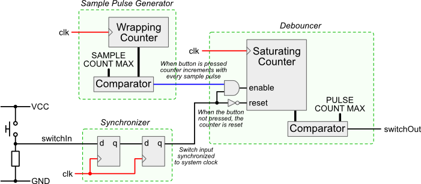

# FPGA Lab 3: More Sequential Circuits, Audio "DAC"
<p align="center">
Prof. Bora Nikolic
</p>
<p align="center">
TAs: Alisha Menon, Zhenghan Lin, Charles Hong, Vighnesh Iyer
</p>
<p align="center">
Department of Electrical Engineering and Computer Science
</p>
<p align="center">
College of Engineering, University of California, Berkeley
</p>

## Before You Begin
### Fetch Latest Lab Skeleton
```shell
cd fpga_labs_fa21
git pull origin master
```

### Verilog Reading
Look through these documents if you haven't already.
You should have a decent understanding of Verilog for this lab.

- [Verilog Primer Slides](https://inst.eecs.berkeley.edu/~eecs151/fa21/files/verilog/Verilog_Primer_Slides.pdf) - overview of the Verilog language
- [wire vs reg](https://inst.eecs.berkeley.edu/~eecs151/fa21/files/verilog/wire_vs_reg.pdf) - the differences between `wire` and `reg` nets and when to use each one
- [always @ blocks](https://inst.eecs.berkeley.edu/~eecs151/fa21/files/verilog/always_at_blocks.pdf) - understanding the differences between the two types of `always @` blocks and what they synthesize to

## Overview
In this lab we will:

- Build input conditioning circuits so we can safely use the buttons as inputs to sequential circuits
  - Write parameterized Verilog modules
- Use fork/join simulation threading and file IO in Verilog testbenches
- Create an audio "DAC" using a PWM generator
- Write a square wave signal generator
- Test the circuit on the FPGA

## Additional Testbench Constructs
The testbenches provided in this lab use some constructs we haven't covered yet.
Here is an overview of constructs you should know:

- `@(posedge <signal>)` and `@(negedge <signal>)`
    - These are event trigger statements which are similar to the delay statements you've seen before
    - `#10` advances the simulation by 10 timesteps
    - `@(posedge <signal>)`/`@(negedge <signal>)` will advance the simulation until the `<signal>` rises/falls.
    - For example, this block will advance simulation time until we have seen two rising edges of `clock`:
    ```verilog
    @(posedge clock);
    @(posedge clock);
    ```

- `repeat`
    - Acts like a `for` loop but without an increment variable
    - For example, this block will advance the simulation until we have seen 2 falling clock edges, and will then advance further until we have seen 10 rising clock edges.
    ```verilog
    repeat (2) @(negedge clk);
    repeat (10) begin
        @(posedge clk);
    end
    ```

- `$display`
    - A print statement. Similar to `printf` in C. You call `$display()` with a format string and arguments.
    ```verilog
    $display("Wire x in decimal is %d", x);
    $display("Wire x in binary is %b", x);
    // You can even print out the current simulation time
    $display("Time %d", $time);
    ```
    - Lab 2 covered `$error()` which works like `$display()`, but is used to print an error message

- **Tasks**
    - Tasks are subroutines that can group together simulation commands (similar to functions).
    - They can take inputs and assign outputs. They can be called like functions in an `initial` block.
    ```verilog
    task wait_for_n_clocks();
    input [7:0] num_edges;
    begin
      repeat (num_edges) @(posedge clk);
    end
    endtask

    initial begin
        a = 16'd1;
        b = 16'd3;
        wait_for_n_clocks(10);
        assert(sum == 16'd4);
    end
    ```

- `fork`/`join`
    - Allows you to execute blocks simulation code in parallel. You create a fork block with the keyword `fork` and end the block with the keyword `join`.
    ```verilog
    fork
      begin
        task1();
      end
      begin
        $display("Another thread");
        task2();
      end
    join
    ```
    - Multiple threads of execution are created by putting multiple begin/end blocks in the fork-join block.
    - In this example, thread 1 runs `task1()`, while thread 2 first `$display`s some text then runs `task2()`. The threads run in parallel.

- Hierarchical Paths
    - You can access signals *inside* an instantiated module for debugging purposes using `.` to provide a path to the signal. This can be helpful in some cases where you want to look at an internal signal but don't want to create another output port just for debug.
    ```verilog
    // RTL
    module m(input [1:0] a, output y);
        wire q; // internal signal
        assign q = |a
        assign y = ~q;
    endmodule
    ```
    ```verilog
    // Testbench
    m dut(.a(a), .y(y));
    $display("a: %d", a);
    $display("dut.q: %d", dut.q);
    ```

## Input Conditioning Circuits
We want to use the buttons as inputs to a sequential circuit. For example, we may want to press a button to increment a counter, and press another one to decrement a counter.

However, there are a few issues with using the raw button signals in our circuits:
  - A button press is an asynchronous signal (it is not aligned to any clock edge): we need to sample the button signal safely from our 125 MHz clock domain
  - When we press a button, we want a signal that goes high for only one clock cycle indicating a single press: we need to detect the rising edge of the button signal
  - When a button is pressed, the connection of the button net to VDD isn't instant and clean (the button *bounces*): we need to add hysteresis

### Synchronizer
In synthesizable Verilog (RTL), digital signals are either 0's or 1's (low/high voltage level).
If the circuit is well designed and timed (fully synchronous), we only have to worry about the low and high voltage states.

The signals coming from the push buttons and slide switches on the PYNQ board don't have an associated clock (they are asynchronous).
When the button signals are put through a register, its hold or setup time requirements may be violated.
This may put that register into a *metastable* state.

<p align=center>
  

<p align=center>
  <em>The `ball on a hill' metaphor for metastability. If a register's timing constraints are violated, its output voltage oscillates and after some time unpredictably settles to a stable state.</em>
</p>

In a fully synchronous circuit, the timing tools will determine the fastest clock frequency under which the setup time constraints are all respected and the routing tools will ensure that any hold time constraints are handled.
An asynchronous signal could violate timing constraints, make the output of the register metastable, and violate more downstream constraints: making the circuit fail.

We will implement a synchronizer circuit that will safely bring an asynchronous signal into a clock domain.
The synchronizer needs to have a very small probability of allowing metastability to propagate into our synchronous circuit.

The synchronizer circuit for this lab is simple.
<p align=center>
  
</p>
<p align=center>
  <em>1-bit 2 Flip-Flop Synchronizer</em>
</p>

For synchronizing one bit, it is a pair of flip-flops connected serially.

**Edit** `lab2/src/synchronizer.v` to implement the two flip-flop synchronizer.
This module is parameterized by a `WIDTH` parameter which controls the number of one-bit signals to synchronize.

A testbench is provided in `lab2/sim/sync_tb.v`. **Run the testbench** with `make sim/sync_tb.vpd` (VCS) or `make sim/sync_tb.fst` (Icarus Verilog) as usual.

### Edge Detector
We want to convert the low-to-high transition of a button press to a 1 clock cycle wide pulse that the rest of our design can use.

**Implement** a parameterized-width edge detector in `lab2/src/edge_detector.v`.

A testbench is provided in `lab2/sim/edge_detector_tb.v`. **Run it as usual**.

The edge detector testbench tests that your `edge_detector` outputs a 1 cycle wide pulse when its corresponding input transitions from 0 to 1.
You should **visually inspect the waveform** to verify the correct behavior too.

### Debouncer
<p align=center>
  
</p>
<p align=center>
  <em>Architecture of a simple debouncer circuit. <a href="http://www.labbookpages.co.uk/electronics/debounce.html">Source</a></em>
</p>

The debouncer circuit takes a button's glitchy digital signal and outputs a clean signal indicating a single button press.
The reason for this circuit is seen in the figure below, whichi 

\begin{figure}[H]
  \centerline{\includegraphics[width=0.5\textwidth]{figs/bouncing.png}}
\end{figure}

When we press or depress a button, the signal doesn't behave like a perfect step function.
Instead the button signal is glitchy due to mechanical ``bounce''.
If we naively used the button signal directly there would be many spurious ``button presses".

Look at \verb|lab2/src/debouncer.v|.
This is a parameterized debouncer which can debounce \verb|width| signals at a time.
The other parameters reference the constants used in the circuit from the prelab reading.

The debouncer consists of:
\begin{enumerate}
  \item \textbf{Sample Pulse Generator} - Tells our saturating counter when to sample the input signal. It should output a 1, every \verb|SAMPLE_CNT_MAX| clock cycles. By default \verb|SAMPLE_CNT_MAX| is set to 25000.
  \item \textbf{Saturating Counter} - This is a counter that counts up to \verb|PULSE_CNT_MAX|.
    If the sample pulse is high at a clock edge, increment the counter if the input signal is also high, else reset the counter to 0.
    Once the saturating counter reaches \verb|PULSE_CNT_MAX|, it should hold that value indefinitely until the sampled input signal becomes 0.
    The \verb|debounced_signal| of your debouncer should be an equality check between the saturating counter and \verb|PULSE_CNT_MAX|.
\end{enumerate}

You can use the same sample pulse generator for all input signals into your \verb|debouncer|, but you should have a separate saturating counter per input signal.

\subsubsection{Debouncer Simulation}
A testbench has been provided in \verb|lab2/sim/debouncer_tb.v|. Make sure you understand what the testbench is doing. Run it as usual.

The debouncer testbench has 2 tests:
\begin{enumerate}
  \item Verifies that if a glitchy signal initially bounces and then stays high for \textbf{less} than the saturation time, that the debouncer output never goes high.
  \item Verifies that if a glitchy signal initially bounces and then stays high for \textbf{more} than the saturation time, that the debouncer goes high and stays high until the glitchy signal goes low.
\end{enumerate}

Pay attention to the printouts in the \emph{TCL Console} to see if tests are passed or failed.


The debouncer will *smooth-out* the button press signal from the sychronizer.

Here is an \textit{example} of creating a 2D array of \emph{reg} (works for \emph{wires} too):

\begin{minted}[tabsize=4]{verilog}
reg [7:0] arr [3:0]; // 4 X 8-bit array
arr[0]; // First byte from arr (8 bits)
arr[1][2]; // Third bit of 2nd byte from arr (1 bit)
\end{minted}

## Lab Deliverables
### Lab Checkoff (due: 11AM, Friday Sept 10th, 2021)
- Please submit answers for the questions in [Understanding Your FPGA](#user-content-understanding-your-fpga) to the [Gradescope assignment](https://www.gradescope.com/courses/295948/assignments/1451298).

To checkoff for this lab, have these things ready to show the TA:
  - Demonstrate that you can generate a bitstream from the given sample code using Vivado. In addition, please show that you can program your FPGA board correctly.
  - Modify the sample code to implement a 4-input logic function of your choice. Use the four buttons (`BUTTONS[3:0]`) as inputs, and the the 2nd LED as output (`LEDS[1]`). Demonstrate that your logic circuit works correctly on the FPGA board.

*Note*: You can declare wires in Verilog to hold intermediate boolean signals and drive them using `and` and `or` gates.
```verilog
input in1, in2, in3;
output out;
wire a, b;
and(a, in1, in2);
or(b, a, in3);
and(out, b, a);
```

## Acknowledgement
This lab is the result of the work of many EECS151/251 GSIs over the years including:
- Sp12: James Parker, Daiwei Li, Shaoyi Cheng
- Sp13: Shaoyi Cheng, Vincent Lee
- Fa14: Simon Scott, Ian Juch
- Fa15: James Martin
- Fa16: Vighnesh Iyer
- Fa17: George Alexandrov, Vighnesh Iyer, Nathan Narevsky
- Sp18: Arya Reais-Parsi, Taehwan Kim
- Fa18: Ali Moin, George Alexandrov, Andy Zhou
- Sp19: Christopher Yarp, Arya Reais-Parsi
- Fa19: Vighnesh Iyer, Rebekah Zhao, Ryan Kaveh
- Sp20: Tan Nguyen
- Fa20: Charles Hong, Kareem Ahmad, Zhenghan Lin
- Sp21: Sean Huang, Tan Nguyen
