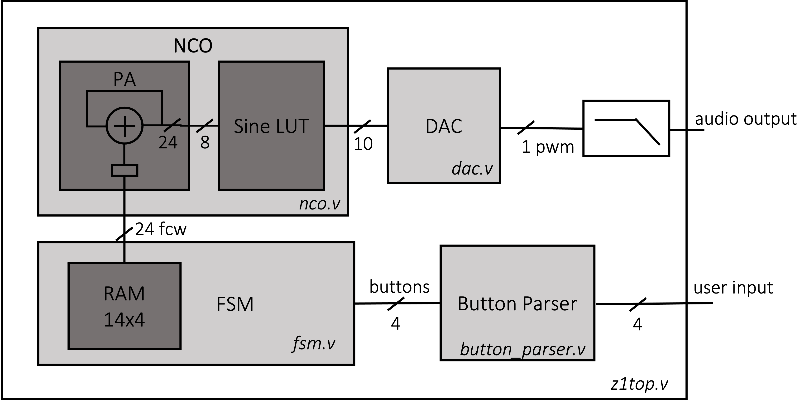
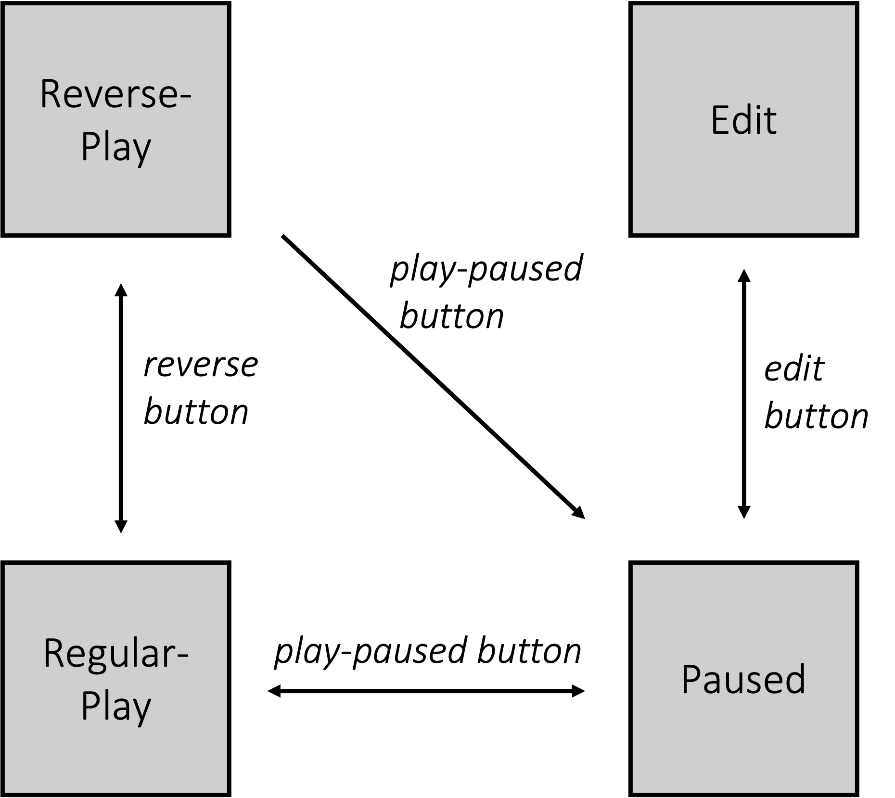

# FPGA Lab 4: Tunable Wave Generator, NCO, FSM
<p align="center">
Prof. Bora Nikolic
</p>
<p align="center">
TAs: Alisha Menon, Zhenghan Lin, Charles Hong, Vighnesh Iyer
</p>
<p align="center">
Department of Electrical Engineering and Computer Science
</p>
<p align="center">
College of Engineering, University of California, Berkeley
</p>

## Before You Begin

### Fetch Latest Lab Skeleton
```shell
cd fpga_labs_fa21
git pull origin master
```

### Copy Sources From Previous Lab
```shell
cp lab3/src/dac.v lab3/src/synchronizer.v lab3/src/debouncer.v lab3/src/edge_detector.v lab4/src
```

### Reading
Look through these documents if you haven't already.

- [Verilog Primer Slides](https://inst.eecs.berkeley.edu/~eecs151/fa21/files/verilog/Verilog_Primer_Slides.pdf) - overview of the Verilog language
- [FSM](https://inst.eecs.berkeley.edu/~eecs151/fa21/files/verilog/verilog_fsm.pdf) - Finite State Machines in Verilog

## Overview
In this lab we will:

- Extend the functionality of the square wave generator we built in lab3
  - Use the buttons to adjust the output wave frequency
- Write a Numerically Controlled Oscillator (NCO)
  - Initialize a ROM with a binary file, and use it as an LUT
  - Design a phase accumulator (PA)
- Design an FSM
  - Use buttons to switch between states
  - Use the FSM to control the sine wave
  - Test the circuit on FPGA

## Part 1: Tunable Square Wave Generator
In lab 3, we built a simple square wave generator which can emit a fixed 440Hz square wave tone. We would like to add more functionality:

- Press `button[0]` increases the output frequency. For your convenience, the frequency step doesn’t have to be linear. Make sure the step is reasonable.
- Press `button[1]` decreases the output frequency.
- Press button[3] resets the output frequency to 440Hz.
<!--- You can use button[2] at will. For example, use it as volume control-->

Write a testbench for the modified `sq_wave_gen.v`. If you feel confident about your code, you can skip this part and directly program the FPGA. Make sure your code can handle overflow problems (what happens when you keep pressing the same button?)

Save the bitstream, or you can check off this part by your TA

## Part 2: NCO
The top level schematic for the rest of this lab is shown below:

<p align=center>
  
</p>

### NCO Overview
Now we can generate tunable square waves using `sq_wave_gen`. What about sine waves? A continuous time sine wave, with a frequency , can be written as:

<p align=center>

</p>

If this sine wave is sampled with sampling frequency , the resulting stream of discrete time samples is:

<p align=center>

</p>

We want to generate this stream of samples in hardware. One way to do this is to use a lookup table (LUT) and a phase accumulator (PA, just a register and an adder). Say we have a LUT that contains sampled points for one period of a sine wave with  entries. The entries `i`  of this LUT are:

<p align=center>

</p>

To find the mapping of the sample n to the LUT entry i, we can equate the expressions inside :

<p align=center>

</p>
<p align=center>

</p>

This means that to compute sample `n+1`, we should take the LUT index used for sample `n` and increment the index by the **phase increment**. The phase increment (also called the **frequency control word (FCW)**).

To find the frequency resolution (the minimum frequency step) we can look at what change in  causes the phase increment to increase by 1:

<p align=center>

</p>
<p align=center>

</p>

In this lab we will use `N=24`. Recall that in lab 3, our DAC has a frequency of `122kHz`, which means the frequency resolution is `0.007Hz`. We can have very precise frequency control using an NCO.

However, a  entry LUT is huge and wouldn't fit on the FPGA. So, we will keep the phase accumulator `N` (24-bits) wide, and only use the MSB `M` bits to index the sine wave LUT. This means the LUT only contains  entries, where `M` can be chosen based on the required phase error. We will use `M = 8` in this lab.

### NCO Model
We’ve generated a binary file `sine.bin` for you. You can also run the following command to re-generate it:
```shell
python scripts/nco.py --sine-lut > sine.bin
```

We will use the binary file to initialize the 2D array as a ROM. You can read in a LUT binary using $readmemb():
```verilog
reg [x:0] sine_lut [y:0];
initial begin
$readmemb(“sine.bin”, sine_lut);
end
```

**Write code** for the phase accumulator in nco.v. Note that the PA uses the main clock and runs at 125MHz.

**Uncomment** the modules in `z1top.v`. The nco is connected to a sampler, which simply passes the data to the DAC when it is ready for the new data.

The input of NCO comes from a random access memory (RAM). We provide a simple RAM module with 1 read port and 1 write port. Check the `fsm_ram.v` for details. Note that the read is asynchronous while the write is synchronous. The RAM contains 4 24-bit values, which correspond to different fcws for different target frequencies. We would like to create 4 different sine waves at the following frequency:
- 440 Hz
- 494 Hz
- 523 Hz
- 587 Hz

**Calculate** the corresponding FCW and save them as the default value of RAM.

### NCO Testbench
We have provided a simple testbench for nco. Run it as normal. Feel free to add more test cases.


## Part 3: FSM
In this part, you will implement an FSM in the fsm.v. The FSM takes the debounced button signals as inputs, and output
The FSM has 4 states: REGULAR_PLAY, REVERSE_PLAY, PAUSED, EDIT. Here is the state transition diagram:

<p align=center>
  
</p>

- The initial state should be **REGULAR_PLAY**. In this state, the audio should play the notes one by one. Each note should be played for **1 second**.
- Pressing the **play_pause button (button[0])** should transition you into the **PAUSED** state from either the REGULAR_PLAY or **REVERSE_PLAY** states. Pressing the same button while in the PAUSED state should transition the FSM to the REGULAR_PLAY state.
- In the PAUSED state, the RAM address should be held steady at its value before the transition into PAUSED and the current note should come out of the speaker continuously. After returning to the REGRLAR_PLAY state, the RAM address should begin incrementing again from where it left off and the speaker should play the tones.
- You can toggle between the REGULAR_PLAY and REVERSE_PLAY states by using the **reverse button (button[1])**. In the REVERSE_PLAY state, you should decrement the RAM address by 1 rather than increment it by 1
- **EDIT** state can only be entered when the **edit button (button[2])** is pressed in the PAUSED state. In the EDIT state, the current note should come out of the speaker continuously. Pressing button[0] will decrease the frequency of the current tune, while pressing button[1] should increase the frequency. You can decide the step at will and it doesn’t have to be linear. Pressing the edit button should transition the FSM back to the PAUSED stage.
- Hit **reset button (button[3])** should return to REGULAR_PLAY state, and all modified tunes should be reset to the original value.
- If you don't press any buttons, the FSM shouldn't transition to another state.

The LEDS[3:0] should represent the current state. We have provided some skeleton in the `fsm.v`. If you would like to use different implementations, feel free to modify it.

### FSM Testbench
**Write a testbench** for the FSM. Make sure all state transitions are tested. Use a smaller clock frequency in the testbench to perform simulation in fewer cycles.

### Put Everything Together
Check the top-level diagram again. Make sure that all modules are connected as desired. **Program the FPGA**. Plug headphones into the audio out port, press the reset button, and verify that you hear a regular play tone. Use buttons to switch between different states.


## Lab Deliverables
### Lab Checkoff (due: 11AM, Friday Oct 1st, 2021)
To checkoff for this lab, have these things ready to show the TA:
  - Demonstrate the tunable square wave generator on the FPGA (tempo control, reset)
  - Demonstrate the FSM on the FPGA (FSM with play, reverse play, pause, edit, and reset)
No lab report this week!

## Acknowledgement
This lab is the result of the work of many EECS151/251 GSIs over the years including:
- Sp12: James Parker, Daiwei Li, Shaoyi Cheng
- Sp13: Shaoyi Cheng, Vincent Lee
- Fa14: Simon Scott, Ian Juch
- Fa15: James Martin
- Fa16: Vighnesh Iyer
- Fa17: George Alexandrov, Vighnesh Iyer, Nathan Narevsky
- Sp18: Arya Reais-Parsi, Taehwan Kim
- Fa18: Ali Moin, George Alexandrov, Andy Zhou
- Sp19: Christopher Yarp, Arya Reais-Parsi
- Fa19: Vighnesh Iyer, Rebekah Zhao, Ryan Kaveh
- Sp20: Tan Nguyen
- Fa20: Charles Hong, Kareem Ahmad, Zhenghan Lin
- Sp21: Sean Huang, Tan Nguyen
- Fa21: Charles Hong, Vighnesh Iyer, Alisha Menon, Zhenghan Lin
