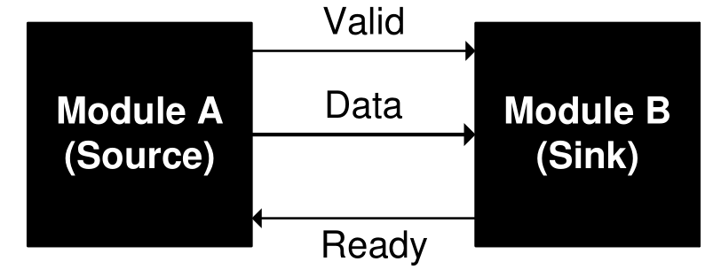
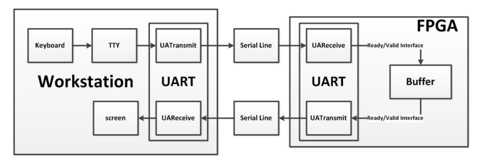
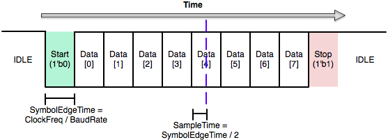

# See sp21 spec and fa19 skeleton
# FPGA Lab 5: FIFOs and UART
<p align="center">
Prof. Bora Nikolic
</p>
<p align="center">
TAs: Alisha Menon, Zhenghan Lin, Charles Hong, Vighnesh Iyer
</p>
<p align="center">
Department of Electrical Engineering and Computer Science
</p>
<p align="center">
College of Engineering, University of California, Berkeley
</p>

## Before You Begin
### Fetch Latest Lab Skeleton
```shell
cd fpga_labs_fa21
git pull origin master
```

### Copy Sources From Previous Lab
```shell
cd fpga_labs_fa21
cp lab4/src/synchronizer.v lab5/src/.
cp lab4/src/edge_detector.v lab5/src/.
cp lab4/src/debouncer.v lab5/src/.
```

### Reading
- Read this document on [ready-valid interfaces](https://inst.eecs.berkeley.edu/~eecs151/fa21/files/verilog/ready_valid_interface.pdf)

## Overview
In this lab we will:

- Understand the ready-valid interface
- Design a first-in-first-out (FIFO) circuit
- Design a universal asynchronous receiver/transmitter (UART) circuit
- Connect the FIFO and UART circuits together, bridging two ready-valid interfaces
- Test the UART on the FPGA using a host computer

## Ready-Valid Interface
Often, we want to design modules that pass data between each other but are unaware of each other's internal timing.
The *ready-valid interface* is a standardized interface and protocol for timing-agnostic data movement between 2 modules.

The ready-valid interface is used to send data from a *source* to a *sink*.

<p align=center>
  
</p>

It consists of 3 wires:
  - `valid` (1 bit, driven by source, received by sink)
  - `data` (D bits, driven by source, received by sink)
  - `ready` (1 bit, driven by sink, received by source)

The sink uses the `ready` signal to tell the source if the sink is able to receive a new piece of data.
Usually the sink can only take in a certain number of data pieces until it is full and has to process what it has already received before it can receive any more.

The source uses the `valid` signal to tell the sink that the `data` bus has data it wishes to send to the sink.

A ready-valid *transaction* only occurs when both `ready` and `valid` are high on a rising clock edge.
If both `ready` and `valid` are high on a rising edge, the source can assume that the sink has received and *internally stored* the bits on `data`.

Here are a few examples:
<!--
wavedrom.com/editor.html
{signal: [
  {name: 'clk', wave: 'p......'},
  {name: 'data', wave: 'x3x33x.', data: ['a', 'x', 'b']},
  {name: 'valid', wave: '010.10.'},
  {name: 'ready', wave: '1......'}
]}
Save a .svg from the wavedrom webapp
Then to convert to .png
rsvg-convert image.svg -f pdf -o image.pdf
convert -density 300 image.pdf image.png
-->

<p align=center>
  
</p>

There are two transactions that take place on the 3rd and 6th rising clock edges.
Note that the source can change `data` when `valid` is not high.

<p align=center>
  
</p>
<!--
{signal: [
  {name: 'clk', wave: 'p......'},
  {name: 'data', wave: 'x3..3.x', data: ['a', 'b']},
  {name: 'valid', wave: '01....0'},
  {name: 'ready', wave: '10.1010'}
]}
-->

The sink can pull `ready` low whenever it isn't ready to accept new data.
In this example, there are 2 transactions that take place on the 5th and 7th rising clock edges.
When the source has `valid` high, but the sink has `ready` low we say that the sink is applying *backpressure* to the source.

The data transfer from source to sink only occurs when *both* `ready` and `valid` are high on a rising edge.

## UART Serial Device
In this lab, we will design a circuit that implements UART serial protocol for transmitting and receiving data over a serial interface.
This will enables circuits on the FPGA to communicate with the workstation, which will allow us to programmatically send data to and from the FPGA.

UART is a 2 wire protocol with one wire carrying data from the workstation → FPGA and the other one carrying data from the FPGA → workstation.
Here is an overview of the setup we will use:

<p align=center>
  
</p>
<p align=center>
  <em>Diagram of the entire setup</em>
</p>

The UART transmit and receive modules use a *ready-valid interface* to communicate with other modules on the FPGA.
Both the UART’s receive and transmit modules will have their own separate ready-valid interface connected appropriately to other modules.

Please note that the serial line itself is not a ready/valid interface.
Rather, it is the modules you will work with in this lab (`uart_transmitter` and `uart_receiver`) that use the ready-valid handshake.

### UART Packet Framing
On the `PYNQ-Z1` board, the physical signaling aspects (such as voltage level) of the serial connection will be taken care of by off-FPGA devices.
From the FPGA's perspective, there are two signals, `FPGA_SERIAL_RX` and `FPGA_SERIAL_TX`, which correspond to the receive-side and transmit-side pins of the serial port.
The FPGA's job is to correctly frame 8-bit data words going back and forth across the serial connection.
The figure below shows how a single 8-bit data word is transferred over the serial line using the UART protocol.

<p align=center>
  
</p>
<p align=center>
  <em>Framing of a UART packet</em>
</p>

In the idle state the serial line is held high.
When the TX side is ready to send a 8-bit word, it pulls the line low.
This is called the start bit.
Because UART is an asynchronous protocol, all timing within the frame is relative to when the start bit is first sent (or detected, on the receive side).

The frame is divided up in to 10 uniformly sized bits: the start bit, 8 data bits, and then the stop bit.
The width of a bit in cycles of the system clock is given by the system clock frequency (`125 MHz`) divided by the baudrate.
The baudrate is the number of bits sent per second; in this lab the baudrate will be **115200**.
Notice that both sides must agree on a baudrate for this scheme to be feasible.

### UART Receiver
<p align=center>
  
</p>
<p align=center>
  <em>Connectivity of the UART receiver</em>
</p>

The receive side of the UART is just a shift register that shifts bits in from the serial line.
However, care must be taken into determining *when* to shift bits in.
If we attempt to sample the `FPGA_SERIAL_RX` signal directly on the edge between two symbols, we are likely to sample on the wrong side of the edge and get the wrong value for that bit.
One solution is to wait halfway into a cycle (until `SampleTime` on the diagram) before reading a bit in to the shift register.

The UART receiver module sends the received 8-bit word to a consumer block on the FPGA via a ready-valid interface.
Once we have received a full UART packet over the serial port, the `valid` signal should go high until the `ready` signal goes high, after which the `valid` signal will be driven low until we receive another UART packet.

You do not need to implement the UART receiver as it is provided to you in `lab5/src/uart_receiver.v`, but you should refer to its implementation when writing the `uart_transmitter`.

### UART Transmitter
<p align=center>
  
</p>
<p align=center>
  <em>Connectivity of the UART transmitter</em>
</p>

The UART Transmitter receives a 8-bit word from a producer block on FPGA via the ready-valid interface.
Once we have a 8-bit word that we want to send (i.e., once `valid` is high, and the transmitter is `ready`), transmitting it involves shifting each bit of the `data[7:0]` bus, plus the start and stop bits, out of a shift register on to the serial line.

Remember, the serial baudrate is much slower than the system clock, so we must wait `SymbolEdgeTime = ClockFreq / BaudRate` cycles between changing the bit we're putting on the serial line.
After we have shifted all 10 bits out of the shift register, we are done unless we have to send another frame immediately after.
The transmitter should not be `ready` when it is in a middle of sending a frame.

**Your task** is to complete the implementation of UART transmitter in `lab5/src/uart_transmitter.v`.

### UART Transmitter Verification


In the process of testing your UART Transmitter, if you see some weird garbage symbols then the data is getting corrupted and something is likely wrong.
If you see this happening very infrequently, don't just hope that it won't happen while the TA is doing the checkoff; take the time now to figure out what is wrong.
UART bugs are a common source of headaches for groups during the first project checkpoint.
Let's use a ready-valid interface to design a Verilog module that can receive data from a UART interface.

### PMOD USB-UART
The PYNQ-Z1 does not have an RS-232 serial interface connected to the FPGA fabric.
So we'll be using the \href{https://store.digilentinc.com/pmod-usbuart-usb-to-uart-interface/}{Pmod USB-UART} extension module to add a UART interface to the Pynq.
Connect the PMOD module to the \textbf{top} row of the PMOD A port on the Pynq, and connect a USB cable from the USB-UART PMOD to your computer.

\textbf{Note:} Make sure that the power selection jumper on the Pmod USBUART is set to LCL3V3

\begin{figure}[H]
  \centerline{\includegraphics[width=2in]{figs/pmod_a.jpg}}
  \caption{PMOD USBUART plugged in w/ correct power jumper setting (blue).}
\end{figure}
We will use a Pmod USB-UART module connecting to the PYNQ-Z1 to interface with a host machine.
## Lab Deliverables
### Lab Checkoff (due: 11AM, October 8th, 2021)
To checkoff for this lab, have these things ready to show the TA:
  - A working FIFO testbench and waveform
  - The FIFO/UART circuit working correctly on the FPGA

## Acknowledgement
This lab is the result of the work of many EECS151/251 GSIs over the years including:
- Sp12: James Parker, Daiwei Li, Shaoyi Cheng
- Sp13: Shaoyi Cheng, Vincent Lee
- Fa14: Simon Scott, Ian Juch
- Fa15: James Martin
- Fa16: Vighnesh Iyer
- Fa17: George Alexandrov, Vighnesh Iyer, Nathan Narevsky
- Sp18: Arya Reais-Parsi, Taehwan Kim
- Fa18: Ali Moin, George Alexandrov, Andy Zhou
- Sp19: Christopher Yarp, Arya Reais-Parsi
- Fa19: Vighnesh Iyer, Rebekah Zhao, Ryan Kaveh
- Sp20: Tan Nguyen
- Fa20: Charles Hong, Kareem Ahmad, Zhenghan Lin
- Sp21: Sean Huang, Tan Nguyen
